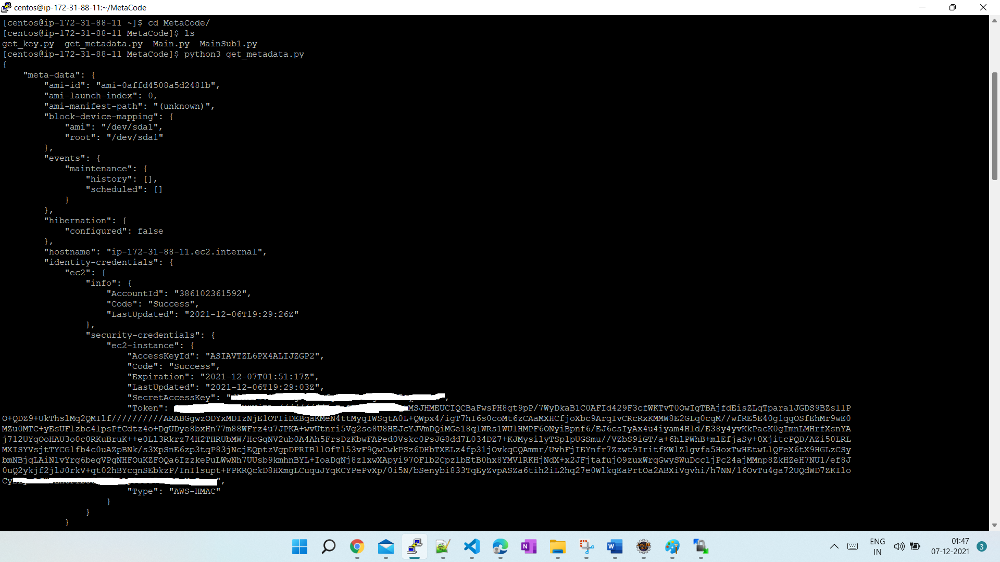

# AWS_Instance_Metadata
Code to bring AWS instance metadata in Json format

## Prerequisites & Execution Process
- Have an AWS account and ec2 instance created(Fine with any configuration).
- Get into the interactive mode of EC2 instance.
- Make sure Python3 installed in EC2.
- Make sure pip3 installed.
- Make sure requests module installed in Python (pip3 install requests)
- Clone/download Metadata.py into a Specific folder in EC2 instance
- Navigate to the folder holding Metadata.py
- execute python script (python3 Metadata.py)

## Executed output screenshorts
